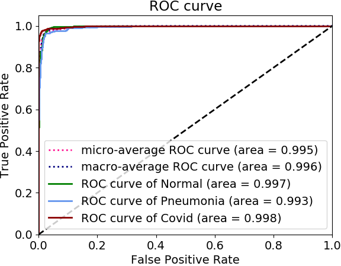
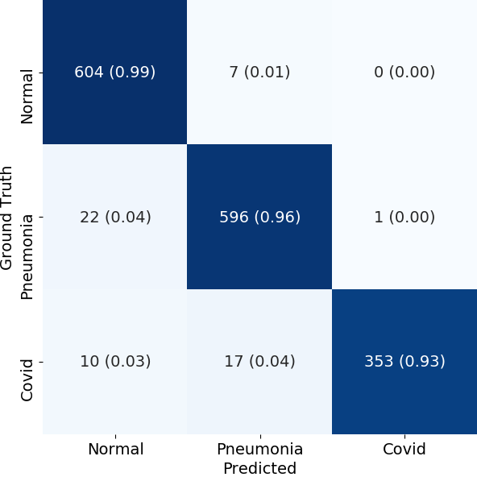

# CovidAID for Detection of SARS-CoV-2 from CXR using Attention Guided CNN.

Chest Radiography (CXR) is among the most common investigations performed world-over and accounts for 25% of total diagnostic imaging procedures. It is a portable, inexpensive, and a safe modality, which is widely used to assess the extent of lung involvement in a wide variety of thoracic pathologies. It is widely available in hospital set-ups even in small peripheral centres and involves minimal contact with the patient. However, CXR has not been seen to be sensitive or specific for changes of COVID-19. While many patients do not show any changes on chest radiography (to an expert eye), those who do show changes are difficult to differentiate from other forms of pneumonia.

We introduce `CovidAID` which takes a CXR as an input and outputs either 3-Class probabilities: `Normal`, `Pneumonia` and `Covid-19` or 4-Class probabilities: `Normal`, `Bacterial Pneumonia`, `Viral Pneumnonia` and `Covid-19`. It consists of 3 models: **Global Model**: which incorporates the whole input image to make a decision, **Local Model**: which incorporates the discriminative features extracted from global model to make a decision and **Fusion Model**: which uses both global and local features obtained from above models to make a decision.

It is based on [Diagnose like a Radiologist: Attention Guided Convolutional Neural Network for Thorax Disease Classification](https://arxiv.org/abs/1801.09927) and its reimplementation by [Ien001](https://github.com/Ien001/AG-CNN). The initial weights used for training were obtained from [CheXNet](https://github.com/arnoweng/CheXNet).

## Dataset
`CovidAID` uses the [covid-chestxray-dataset](https://github.com/ieee8023/covid-chestxray-dataset), [BSTI-dataset](https://www.bsti.org.uk/training-and-education/covid-19-bsti-imaging-database/), [BIMCV](https://bimcv.cipf.es/bimcv-projects/bimcv-covid19/#1590858128006-9e640421-6711), [IIT-KGP](https://ieee-dataport.org/open-access/covid19action-radiology-cxr) for COVID-19 X-Ray images and [chest-xray-pneumonia](https://www.kaggle.com/paultimothymooney/chest-xray-pneumonia), [RSNA](https://www.kaggle.com/c/rsna-pneumonia-detection-challenge) dataset for data on Pneumonia and Normal lung X-Ray images. 

More datasets can be added as required by making changes in `data_tools/prepare_covid_data.py` and `data_tools/prepare_data.py`. It is recommmended to use 3-class classification as much of the **viral** and **bacterial** pneumonia data is of pediatric patients which induces a bias. The above mentioned datasets should be downloaded and placed in the root of this directory.

## Getting Started
### Installation
Clone this repo:
```
git clone https://github.com/sumanyumuku98/CovidAid_V2.git
```
Create venv:
```
conda env create -f env.yml
conda (or source) activate covid
```
### Data Preparation
Remove the `--combine_pneumonia` flag in below cases for 4-class classification.
1. Prepare Covid-19 Dataset:
  ```
  python data_tools/prepare_covid_data.py --bsti --kgp_action --bmcv
  ```
  * Make sure that the name of folders is similar to that mentioned in `prepare_covid_data.py` for the above mentioned datasets.
2. Combine all Data:
  ```
  python data_tools/prepare_data.py --combine_pneumonia --bsti --kgp_action --bmcv
  ```
  * Labels Assigned to respective categories:
    * Class 0: Normal
    * Class 1: Pneumonia
    * Class 2: Covid-19
    
### Transfer CheXNet Weights
This script is used to transfer the `CheXNet` weights from [here](https://github.com/arnoweng/CheXNet) to our model and replace the final layer with 3 or 4 classes respectively. By default, the transferred weights have been provided in `data/` folder and you won't need to run this. But in case you want to initialize the model with different number of classes then you can run this.
```
python tools/transfer.py --combine_pneumonia
```
### Training
By default the weights are saved in `models/` folder but it is advised to specify some other directory for saving the weights.
```
python tools/train_AGCNN.py --mode train --ckpt_init data/CovidXNet_transfered_3.pth.tar --combine_pneumonia --epochs 100 --bs 16 --save <path_to_save_dir>
```
In order to resume training:
```
python tools/train_AGCNN.py --mode train --resume --ckpt_G <Path_To_Global_Model> --ckpt_L <Path_To_Local_Model> --ckpt_F <Path_To_Fusion_Model> --save <Path_To_Save_Dir> --combine_pneumonia
```
### Evaluation
Binary evaulation can be done i.e `Non-Covid` V/s `Covid` by setting `binary_eval=True` in `test` function in `tools/train_AGCNN.py`. By default, it will compute metrics for classes based on `--combine_pneumonia` flag.
```
python tools/train_AGCNN.py --mode test --combine_pneumonia --ckpt_G <Path_To_Best_Global_Model> --ckpt_L <Path_To_Best_Local_Model> --ckpt_F <Path_To_Best_Fusion_Model> --bs 16 --cm_path plots/cm_best --roc_path plots/roc_best
```
### Visualization and Inference
In order to get RISE visualizations and class probabilities on a set of images:
```
python tools/inference.py --combine_pneumonia --checkpoint <Path_To_Best_Global_Model> --img_dir <Path_To_Images> --visualize_dir <Path_To_Out_Dir>
```
In order to get Attention maps and class probabilities:
```
python tools/train_AGCNN.py --mode visualize --combine_pneumonia --img_dir testsample --visualize_dir testresults --ckpt_G models/Gloval_Best.pth --ckpt_L models/Local_Best.pth --ckpt_F models/Fusion_Best.pth
```


## Results

We obtained an accuracy of around `96.46%` on the public test set. The mean AUROC for 3-Class configuration was around `0.996`. The respective confusion matrix and ROC curve has been shown below:

<center>
<table>
<tr><th></th><th>3-Class Classification</th></tr>
<tr>
<td></td>
<td>

| Pathology  |   AUROC    | Sensitivity | PPV
| :--------: | :--------: | :--------: | :--------: |
| Normal  | 0.9966 | 0.99 | 0.95
| Pneumonia | 0.9932 | 0.96 | 0.96
| COVID-19 | 0.9982 | 0.93 | 1.00

</td></tr> 
<tr>
<td>ROC curve</td>
<td>



</td>
</tr>
<tr>
<td>Confusion Matrix</td>
<td>



</td>
</tr>


</table>
</center>

## Visualizations
To  demonstrate  the  results  qualitatively,  we  generate  saliency  maps  for  our model’s  predictions  using  RISE. The purpose of these visualizations was to have an additional check to rule out  model  over-fitting  as  well  as  to  validate  whether  the  regions  of  attention correspond to the right features from a radiologist’s perspective. Below are some of the saliency maps on COVID-19 positive X-rays.

<center>

<table>
<tr>
<td>

 

</td><td> 

 

</td><td> 


</td></tr>

<tr><td> 

 

</td><td> 

 

</td><td>


</td></tr>
</table>


</center>


